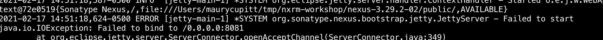

# Nexus Repository Manager

Quick Start - https://guides.sonatype.com/repo3/quick-start-guides/proxying-maven-and-npm/

Configure NPM group and client - https://help.sonatype.com/repomanager3/formats/npm-registry

Docker Installation (Optional):

```
Install: https://docs.docker.com/desktop/

Nexus Integration: https://hub.docker.com/r/sonatype/nexus3

$ docker volume create --name nexus-data

$ docker run -d -p 8081:8081 --name nexus -v nexus-data:/nexus-data sonatype/nexus3
```


### Installation Gotchyas
Common problems and helpful tips


- If following the maven quickstart guide, delete the maven proxy and build manually


- If port 8081 already in use:
  - Start nexus `./bin/nexus run`

  - cd `sonatype-work/nexus3/etc`
  - edit `nexus.properties`
  - uncomment application port, specify the one you want to use, and save


- Finding the .m2 directory:
  - Mac: `cd ~/.m2`
  - PC: `mvn -version` will show you the path
  - You may have to create the `settings.xml` file yourself if none is found


### Requirements

Before you can set up the proxy server for Maven and npm, you’ll need to install and configure the following external tools for the repository manager:

- Java 8 Development Kit (JDK) - Nexus Repository Manager is a Java server application. As explained in System Requirements, we strongly recommend using Java 8 to ensure effective runtime of Nexus Repository Manager 3.

- [Apache Maven](https://maven.apache.org/download.cgi){:target="_blank"} - When downloaded, Nexus Repository Manager 3 includes access to open source components from the Central Repository by default. These components are defined by both a settings.xml file and a Project Object Model file (POM), which maintains information on projects and dependencies.

- [npm](https://www.npmjs.com/get-npm){:target="_blank"} - A popular format supported by the repository manager. Unlike Maven, Nexus Repository Manager 3 doesn’t currently ship with a default npm repository configuration. These components are configured with an .npmrc file.


<br>
...Continue to Lab 1 by clicking [here](https://github.com/sonatype-nexus-community/sonatype-field-workshop/blob/main/dep-confusion.md).
